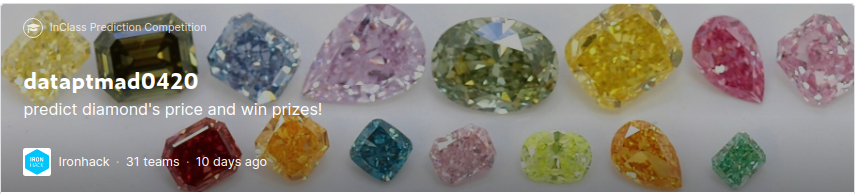
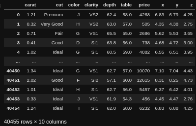
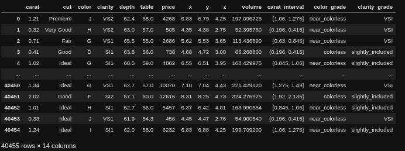

# IH Data Analytics 0420 Project M2

In this project we are challenged to build a machine learning model to predict the price of diamonds!

---

### :running: **One-liner**
This dashboard shows an in-depth analysis of a provided dataset of diamonds in order to stablish a good decision making process for buying one.

### :computer: **Technology stack**
Python, Sci-kit Learn, Pandas, Plotly, Seaborn, Matplotlib.

### :love_letter: **Contact info**
davidblancoferrandez@gmail.com
